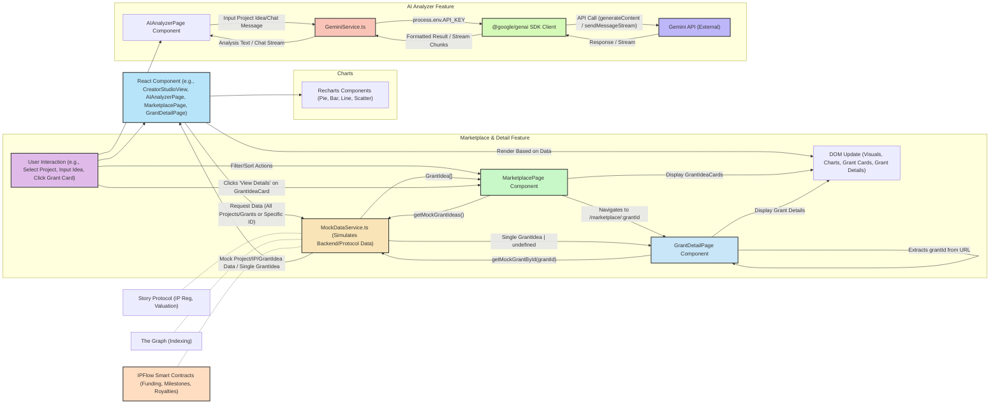

# IPFlow Architecture & Design Notes

## UI Component Hierarchy (Simplified)

```mermaid
graph TD
    App --> HashRouter
    HashRouter --> SidebarNav
    HashRouter --> MainContentArea

    SidebarNav --> NavLinkHome["NavLink (Home)"]
    SidebarNav --> NavLinkCreator["NavLink (Creator Studio)"]
    SidebarNav --> NavLinkInvestor["NavLink (Investor Dashboard)"]
    SidebarNav --> NavLinkMarketplace["NavLink (Marketplace)"]
    SidebarNav --> NavLinkAnalyzer["NavLink (AI Analyzer)"]

    MainContentArea --> Routes
    Routes --> HomePage
    Routes --> CreatorDashboardPage
    Routes --> InvestorDashboardPage
    Routes --> MarketplacePage
    Routes --> GrantDetailPageLinked["GrantDetailPage (Linked from Marketplace)"] %% Added GrantDetailPage
    Routes --> AIAnalyzerPage

    HomePage --> SectionHeaderComponent["SectionHeader"]
    HomePage --> CardComponent["Card"]
    HomePage --> ButtonComponent["Button"]

    CreatorDashboardPage --> CreatorStudioView
    CreatorStudioView --> SectionHeaderComponent
    CreatorStudioView --> CardComponent
    CreatorStudioView --> BackerAnalyticsPanel
    CreatorStudioView --> FundingFlowMatrix
    CreatorStudioView --> StakeHealthMonitor
    CreatorStudioView --> MilestoneBuilderUI

    BackerAnalyticsPanel --> RadialProgressChartComponent["RadialProgressChart (Recharts)"]
    BackerAnalyticsPanel --> BarChartComponent["BarChart (Recharts for Geo)"]
    FundingFlowMatrix --> WaterfallRechartComponent["WaterfallRechart (Recharts)"]
    StakeHealthMonitor --> DualAxisLineRechartComponent["DualAxisLineRechart (Recharts)"]
    StakeHealthMonitor --> RiskMeterComponent["RiskMeter"]
    MilestoneBuilderUI --> MilestoneCardInternal["MilestoneCard"]
    MilestoneBuilderUI --> ButtonComponent

    InvestorDashboardPage --> InvestorDashboardView
    InvestorDashboardView --> SectionHeaderComponent
    InvestorDashboardView --> CardComponent
    InvestorDashboardView --> IPRiskConstellationView
    InvestorDashboardView --> IPLiquidityRingsView
    InvestorDashboardView --> IPValuationTimelineView
    InvestorDashboardView --> PortfolioMetricsSuite

    IPRiskConstellationView --> ScatterChartComponent["ScatterChart (Recharts - 2D Conceptual)"]
    IPLiquidityRingsView --> PieChartMultiLayer["PieChart (Recharts - Concentric)"]
    IPValuationTimelineView --> LineChartComponent["LineChart (Recharts)"]
    PortfolioMetricsSuite --> DiversificationCard["DiversificationScoreCard (Bubble/Scatter)"]
    PortfolioMetricsSuite --> ROICardInternal["ROICard"]
    PortfolioMetricsSuite --> RiskMatrixCard["RiskExposureMatrix (Table)"]
    PortfolioMetricsSuite --> YieldCalculatorCard["YieldCalculator"]
    
    MarketplacePage --> SectionHeaderComponent
    MarketplacePage --> CardComponent %% For filters
    MarketplacePage --> GrantIdeaCardInternal["GrantIdeaCard (custom, uses Card & Button as Link)"]
    GrantIdeaCardInternal -- Navigates to --> GrantDetailPageLinked
    
    GrantDetailPageLinked --> SectionHeaderComponent
    GrantDetailPageLinked --> CardComponent
    GrantDetailPageLinked --> ButtonComponent
    GrantDetailPageLinked --> LoadingSpinnerComponent["LoadingSpinner"]
    
    AIAnalyzerPage --> CardComponent
    AIAnalyzerPage --> ButtonComponent
    AIAnalyzerPage --> LoadingSpinnerComponent
    AIAnalyzerPage --> ChatInterface

    %% Generic Components
    CardComponent --> ButtonComponent
    RadialProgressChartComponent --> RechartsLib["Recharts Library"]
    WaterfallRechartComponent --> RechartsLib
    DualAxisLineRechartComponent --> RechartsLib
    ScatterChartComponent --> RechartsLib
    PieChartMultiLayer --> RechartsLib
    LineChartComponent --> RechartsLib
    BarChartComponent --> RechartsLib
```

## Data Flow (Conceptual - Frontend Focus with Mock Services)



## Security Checklist (OWASP Top 10 for Web3 dApps - Conceptual)

This checklist is a high-level guide. Each point requires detailed implementation and auditing.

1.  **A01: Broken Access Control (Web3 Context: Smart Contract Vulnerabilities)**
    *   **Frontend Concern:** Ensure UI correctly reflects permissions and roles derived from (mocked) smart contracts. Prevent users from attempting actions they are not authorized for, even if the actual enforcement is on-chain.
    *   Validate all inputs that might interact with smart contract parameters to prevent unexpected behavior.

2.  **A02: Cryptographic Failures (Web3 Context: Private Key Management, On-Chain Data)**
    *   **Frontend Concern:** This app does NOT handle private keys. If it did, secure storage and usage would be paramount.
    *   Be mindful of displaying sensitive on-chain data. While public, ensure context doesn't reveal unintended information.
    *   `process.env.API_KEY` for Gemini is assumed to be handled securely in the deployment environment. The app itself does not expose or manage it.

3.  **A03: Injection (Web3 Context: Smart Contract Calls, Oracle Data)**
    *   **Frontend Concern:** Sanitize all user inputs, especially those that might form part of (mocked) data queries or display.
    *   For the Gemini API, ensure prompts are constructed safely if user input is part of the prompt. The current implementation uses fixed prompt structures with user input as a quoted string.
    *   Beware of displaying rich text from AI if it could contain malicious HTML/script (use `pre` or sanitize). User-generated content in marketplace descriptions should also be sanitized if rendered as HTML (currently rendered as text or `whitespace-pre-line`).

4.  **A04: Insecure Design (Web3 Context: Flawed Economic Models, Governance Attacks)**
    *   **Frontend Concern:** The UI should accurately represent the (mocked) economic models and governance mechanisms. Provide clear information to users about how these systems work.
    *   Design for clarity to prevent users from making mistakes based on misunderstood UI.

5.  **A05: Security Misconfiguration (Web3 Context: Default Wallet Permissions, Node Config)**
    *   **Frontend Concern:** Ensure all third-party libraries (Tailwind, Recharts, Lucide) are up-to-date.
    *   The application relies on HTTPS (assumed by modern browser environments for API calls).

6.  **A06: Vulnerable and Outdated Components (Web3 Context: Smart Contract Libraries, Wallets)**
    *   **Frontend Concern:** Keep React, `react-router-dom`, `recharts`, `lucide-react`, and `@google/genai` updated to their latest stable versions.
    *   Regularly audit dependencies for known vulnerabilities.

7.  **A07: Identification and Authentication Failures (Web3 Context: Wallet Authentication, Signature Replay)**
    *   **Frontend Concern:** This app uses a mocked authentication state. In a real dApp, proper wallet connection (e.g., EIP-1193) and message signing for authenticated actions would be critical (e.g. for posting a grant idea).
    *   The prompt mentions "Web3 wallet + 2FA authentication" via Google Identity Platform - this is a complex integration not implemented here, but would require careful handling of sessions and tokens.

8.  **A08: Software and Data Integrity Failures (Web3 Context: Oracle Manipulation, Upgradeability Risks)**
    *   **Frontend Concern:** Ensure data fetched from (mocked) oracles or APIs is validated before display and use.
    *   Provide clear indicators of data source and recency.
    *   For the Gemini API, handle potential errors and unexpected responses gracefully.

9.  **A09: Security Logging and Monitoring Failures (Web3 Context: On-Chain Event Monitoring)**
    *   **Frontend Concern:** Implement client-side error logging to capture UI issues.
    *   For critical actions (even mocked), log intent and outcome (e.g., "User viewed grant idea X", "User attempted to analyze project idea Y").

10. **A10: Server-Side Request Forgery (SSRF) (Web3 Context: Calls to External Contracts/Oracles from Backend)**
    *   **Frontend Concern:** Not directly applicable to pure frontend, but if the frontend makes calls to a backend which then interacts with other services (like Gemini, or oracles), that backend needs SSRF protection.
    *   The Gemini API calls are made directly from the client via the SDK, which is standard practice for this library when an API key is client-accessible.

**Additional Frontend-Specific Security:**

*   **Cross-Site Scripting (XSS):** React generally protects against XSS by escaping content rendered in JSX. Be cautious when using `dangerouslySetInnerHTML` (not used here). Sanitize any AI-generated content or user-submitted grant descriptions if rendered as HTML. The current marketplace and grant detail page render descriptions as plain text within `<p>` tags or using `whitespace-pre-line`, which is generally safe from script injection.
*   **Cross-Site Request Forgery (CSRF):** Less of an issue for frontends that don't manage sessions with cookies directly, but important if interacting with traditional backends.
*   **Content Security Policy (CSP):** Implement a strong CSP header to restrict sources of scripts, styles, images, etc. This is usually set at the webserver/hosting level. Image URLs in `mockGrantIdeas` are from `unsplash.com`, so a CSP would need to allow this.
*   **API Key Security:** The `process.env.API_KEY` for Gemini is a critical point. In a production scenario with client-side key usage, measures like API key restrictions (e.g., to specific domains/IPs, specific APIs) and monitoring are essential. For highly sensitive operations, a backend proxy is preferred. The prompt mandates direct use.

**Gas Optimization Targets & Latency (Conceptual for Frontend):**

*   **Gas Optimization:** Not directly applicable to the frontend code itself. This is a smart contract concern. The UI would *reflect* gas costs if integrated with a live blockchain.
*   **Data Consistency:** The frontend relies on its (mocked) services for data. In a real system, ensuring consistency between blockchain state, indexed data (The Graph), and off-chain data is crucial. UI should handle potential inconsistencies gracefully (e.g., loading states, error messages).
*   **Latency Benchmarks:**
    *   **Fund Transfer Latency <5ms:** This is an on-chain/backend metric. Frontend can show transaction status.
    *   **Dashboard Load Time <1.2s (10k data points):** Achievable with code splitting (not implemented here for simplicity), virtualization for large lists (Marketplace could benefit from this with many grants), optimized data fetching, and efficient chart rendering. Recharts is generally performant.
    *   **AI Inference Latency <800ms:** This depends on the Gemini API. The frontend should display loading states during API calls. For streaming chat, perceived latency is low as chunks arrive.

**Google Cloud Cost Estimation Tables:**

This is beyond the scope of frontend code generation. Cost estimation would involve:

*   **Vertex AI:** Pricing based on model usage (prediction requests, training if custom models were used).
*   **BigQuery ML:** Pricing for data storage, queries, and model inference.
*   **Identity Platform:** Pricing based on Monthly Active Users (MAUs).
*   **Confidential Space:** Pricing based on vCPU, memory, and uptime of confidential VMs.

These would require a detailed backend architecture and usage projections. The frontend only *simulates* interaction with these.

## Integration Timeline Gantt Chart (Conceptual - High Level)

```mermaid
gantt
    dateFormat  YYYY-MM-DD
    title IPFlow Platform Development Timeline (Conceptual)
    excludes    weekends

    section Core Frontend Setup
    Base React App & Routing :a1, 2024-08-01, 3d
    Tailwind CSS & Basic UI Shell :a2, after a1, 2d
    Core Components (Button, Card, Nav) :a3, after a2, 4d
    Mock Data Service Initial Setup :a4, after a2, 3d

    section Creator Studio
    Backer Analytics Panel UI & Charts :c1, after a3, 5d
    Funding Flow Matrix UI & Chart :c2, after c1, 3d
    Stake Health Monitor UI & Chart :c3, after c2, 4d
    Milestone Builder UI :c4, after c3, 4d

    section Investor Dashboard
    IP Risk Constellation (Conceptual UI) :i1, after a3, 3d
    IP Liquidity Rings UI & Chart :i2, after i1, 3d
    IP Valuation Timeline UI & Chart :i3, after i2, 4d
    Portfolio Metrics Suite UI :i4, after i3, 5d
    
    section Marketplace Feature
    Grant Idea Data Model & Mock Data :m1, after a4, 2d
    Marketplace Page UI & Grant Cards :m2, after m1, 4d
    Grant Detail Page UI :m3, after m2, 3d %% Added Grant Detail Page task
    Filtering & Sorting Logic :m4, after m3, 2d %% Adjusted dependency

    section AI Integration
    Gemini API Service Setup :ai1, after a4, 2d
    AI Project Analyzer Page UI :ai2, after ai1, 4d
    AI Chat Interface :ai3, after ai2, 5d

    section Protocol Simulation (Frontend Mocks)
    Story Protocol Data Simulation :p1, after a4, 3d
    Milestone Payment Release UI Mock :p2, after p1, 2d
    Project Funding UI Mock :p3, after p2, 2d

    section Testing & Refinement
    Component & Unit Testing (Conceptual) :t1, 2024-09-16, 10d %% Adjusted start date
    UX/UI Review & Polish :t2, after t1, 7d
    Documentation (Architecture, Components) :t3, concurrently t1, 5d

    %% Milestone markers
    :milestone, Frontend Shell Complete, 2024-08-10, 1d
    :milestone, Creator Studio v1 Complete, 2024-08-27, 1d
    :milestone, Investor Dashboard v1 Complete, 2024-09-09, 1d
    :milestone, Marketplace v1 Complete, 2024-09-16, 1d %% Adjusted milestone date
    :milestone, AI Features v1 Complete, 2024-09-24, 1d %% Adjusted milestone date
```

This Gantt chart is highly conceptual and assumes parallel work where possible. Actual timelines would vary significantly based on team size, complexity depth, and true backend/smart contract development.
The "AI Studio Model Parameters" from the prompt refer to the parameters for *this* code generation task, not parameters the IPFlow application itself would use to call an AI model, other than temperature/topP etc. for the Gemini API calls. TensorFlow.js for client-side risk assessment is a separate, complex feature not implemented here.
The application primarily uses mock data and simulates interactions with complex backend systems and Web3 protocols. The Gemini API integration is for the AI Analyzer feature.
```